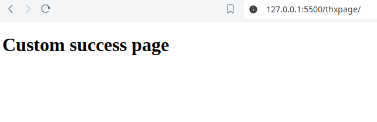
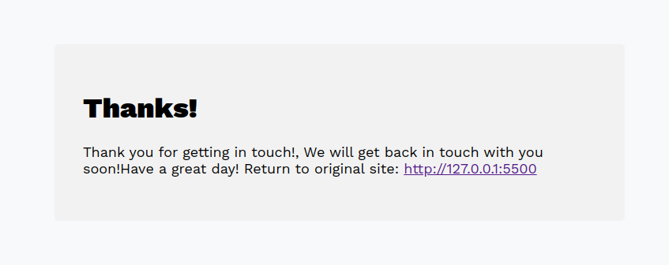
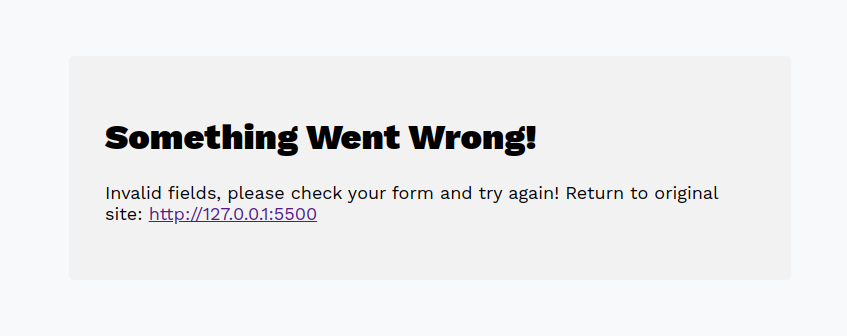
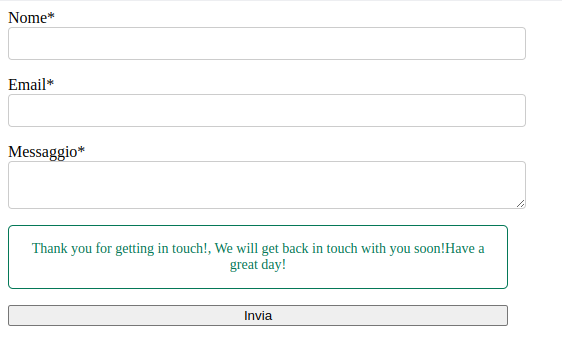
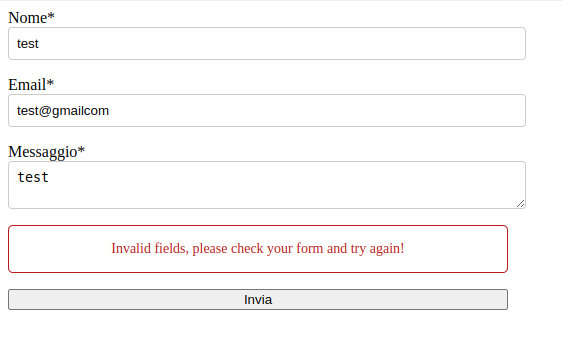

# Form Endpoints

- Is a form backend, API and email service for HTML forms. It sends your site's form submission directly into your inbox.
- License: MIT


## Tech Stack Client

- Node
- Express
- Nodemailer
- EJS


## Form and style example.

- You can use this example to get started.
- Important: The form must be containg the name, email and message fields.

```html
    <style>
      .loading {
        cursor: not-allowed;
        opacity: 0.6;
      }

      .loading::after {
        content: "";
        display: inline-flex;
        gap: 0.5rem;
        border: 2px solid transparent;
        border-radius: 50%;
        border-top-color: #ffffff;
        width: 1em;
        height: 1em;
        animation: spin 1s linear infinite;
        margin-left: 8px;
      }

      @keyframes spin {
        0% {
          transform: rotate(0deg);
        }
        100% {
          transform: rotate(360deg);
        }
      }

      #contactForm {
        display: flex;
        flex-direction: column;
        gap: 1rem;
        max-width: 500px;
      }

      #responseMessage {
        display: none;
        padding: 15px;
        border-radius: 5px;
        font-size: 14px;
        text-align: center;
      }

      .error {
        color: #b91c1c;
        border-color: #b91c1c;
        border-style: solid;
        border-width: 1px;
      }

      .success {
        color: #047857;
        border-color: #047857;
        border-style: solid;
        border-width: 1px;
      }

      #contactForm input,
      textarea {
        display: block;
        width: 100%;
        padding: 0.5rem;
        border-radius: 0.25rem;
        border: 1px solid #ccc;
      }
    </style>
```

```html
    <form id="contactForm" method="POST" action="https://example.com/example@example.com">
      <div>
        <label for="name">Name*</label>
        <input name="name" required/>
      </div>
      <div>
        <label for="email">Email*</label>
        <input name="email" type="email" required/>
      </div>
      <div>
        <label for="message">Message*</label>
        <textarea name="message" required></textarea>
      </div>
      <div id="responseMessage"></div>
      <button id="submitButton" type="submit">Submit</button>
    </form>
```

- You can specify the success page redirect link by adding this:

```html
    <input type="hidden" name="_next" value="https://example.com/thxpage">
```

<div>
    
    
    
</div>


### If you want to use the aler message intead of the getting redirected you can use the following code:

```html
    <form id="contactForm">
      <div>
        <label for="name">Name*</label>
        <input name="name" required/>
      </div>
      <div>
        <label for="email">Email*</label>
        <input name="email" type="email" required/>
      </div>
      <div>
        <label for="message">Message*</label>
        <textarea name="message" required></textarea>
      </div>
      <div id="responseMessage"></div>
      <button id="submitButton" type="submit">Submit</button>
    </form>
```

```html
    <script>
      const form = document.getElementById("contactForm");
      const responseDiv = document.getElementById("responseMessage");
      const submitButton = document.getElementById("submitButton");

      form.addEventListener("submit", async function (event) {
        event.preventDefault();

        const formData = new FormData(form);
        const data = new URLSearchParams(formData);

        submitButton.classList.add("loading");
        submitButton.disabled = true;

        try {
          const response = await fetch(
            "https://example.com/example@example.com",
            {
              method: "POST",
              body: data,
              headers: {
                "Content-Type": "application/x-www-form-urlencoded",
                Accept: "application/json",
              },
            }
          );

          if (response.ok) {
            const result = await response.json();
            responseDiv.style.display = "block";
            responseDiv.innerText = result.message;
            responseDiv.className = "success";
            form.reset();
          } else {
            const error = await response.json();
            throw new Error(error.message);
          }
        } catch (error) {
          responseDiv.style.display = "block";
          responseDiv.innerText = error.message;
          responseDiv.className = "error";
        } finally {
          submitButton.classList.remove("loading");
          submitButton.disabled = false;
          setTimeout(() => {
            responseDiv.style.display = "none";
          }, 5000);
        }
      });
    </script>
```

<div>
    
    
</div>


## Getting Up and Running Locally


### Clone Repo

```bash
git clone https://github.com/Isacco-B/Form-Endpoints.git
```

### Create .env File for the client and server folder.

- Set the following environment variables:

```bash
NODE_ENV=""
PORT=""
HOST=""
ALLOWD_HOSTS = "","",""

EMAIL_HOST=""
EMAIL_NAME=""
EMAIL_ADDRESS=""
EMAIL_PASSWORD=""
EMAIL_PORT=""
EMAIL_SECURITY=""
```

### Install dependencies for each folder

```bash
npm install
```

### Run development server and client

```bash
npm run dev
```

## 🔗 Links

[](https://www.linkedin.com/in/isacco-bertoli-10aa16252/)
